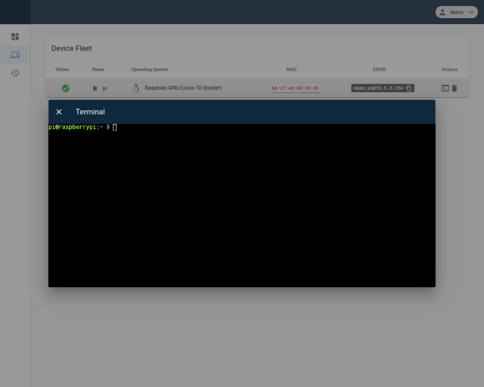

ShellHub is a modern SSH server for remotely accessing Linux devices
via command line (using any SSH client) or web-based user interface.
It is intended to be used instead of _sshd_.

Typically, if you want to SSH a Linux device on a local network,
you just need to know its IP address.
However, in order to access a Linux device from outside the local network,
you will have to go through a few inconveniences, such as getting its public IP
address and configuring the router.
Changing the VPN/firewall configuration can be cumbersome if the device
is behind a corporate firewall that does not allow SSH connections.

ShellHub provides a way to avoid all these hassles, helping you easily and seamlessly access
any Linux device behind firewall and NAT.

