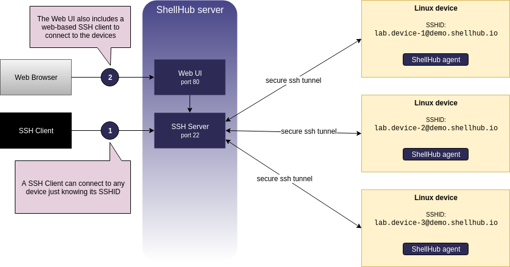

# Introduction

This introduction section is intended to give a high-level overview of the ShellHub.

There are few basic concepts that are important to understand the ShellHub.
Those basic concepts are detailed below:

## SSH gateway

The SSH gateway is a modern SSH server which forward connections to the devices
running ShellHub's agent.

## Device

An internet-connected device, such as a computer or something more specific like a single-board computer, running ShellHub's agent.

## Agent

ShellHub's agent which must be installed on the device.

## SSHID

SSHID is a unique address to identify a device in the SSH gateway, which must
be specified in the following format:

    <NAMESPACE>.<DEVICE_NAME>@<GATEWAY_ADDRESS>

Where:

* `<NAMESPACE>`: Is the account namespace identifier
* `<DEVICE_NAME>`: Is the device name identifier
* `<GATEWAY_ADDRESS>`: Is the gateway address identifier

!!! info "Example of SSHID: `lab.rasp-1@localhost`"
